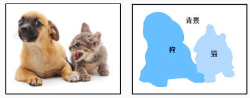

## 语义分割及数据集 

[<<语义分割参考资料>>](<http://zh.gluon.ai/chapter_computer-vision/semantic-segmentation-and-dataset.html>)

### 1、图像分割和实例分割
计算机视觉领域还有2个与语义分割相似的重要问题，即图像分割和实例分割。

-  **图像分割**：图像分割成若干组成区域。这类问题的方法通常利用图像中像素之间的相关性。它在训练时不需要有关图像像素的标签信息，在预测时也无法保证分割出的区域具有我们希望得到的语义。以图9.10的图像为输入，图像分割可能将狗分割成两个区域：一个覆盖以黑色为主的嘴巴和眼睛，而另一个覆盖以黄色为主的其余部分身体。
-  **实例分割**：又叫同时检测并分割。它研究如何识别图像中各个目标实例的像素级区域。与语义分割有所不同，实例分割不仅需要区分语义，还要区分不同的目标实例。如果图像中有两只狗，实例分割需要区分像素属于这两只狗中的哪一只。

### 2、Pascal VOC2012语义分割数据集
